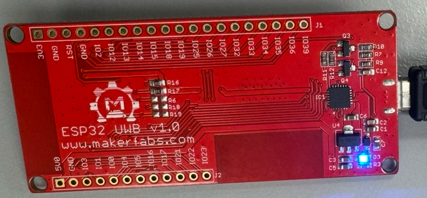
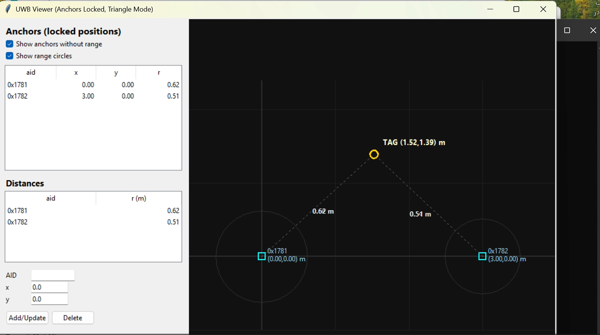
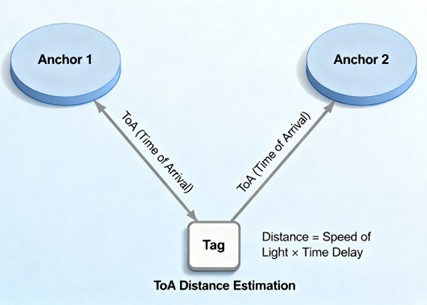

# ESP32 Ultra-Wideband (UWB) Testing


<div align="center">
  
</div>

---

## 📖 About This Project

This project explores the capabilities of **Ultra-Wideband (UWB)** technology for precise indoor positioning and secure data transfer. The primary goal is to investigate UWB's performance in real-world scenarios, specifically focusing on applications for **Hockey Sport**.

We compare UWB with existing technologies like **Bluetooth (BLE)** and **GPS**, highlighting its superiority in indoor accuracy and resistance to interference.

### 🌟 Key Features
*   **High Precision**: ±10 cm indoor accuracy using Time-of-Flight (ToF).
*   **Low Power**: Efficient communication suitable for battery-operated tags.
*   **Dual Functionality**: Combines ESP32's WiFi/BLE with Decawave's UWB capabilities.

---

## 🛠️ Hardware Requirements

For this setup, we utilize **ESP32 UWB modules** acting as **Anchors** (fixed reference points) and **Tags** (mobile devices to be tracked).

| Component | Description | Quantity |
| :--- | :--- | :--- |
| **ESP32 UWB Module** | Core hardware (DW1000 + ESP32) | 3 (2 Tags, 1 Anchor) |
| **Micro-USB Cable** | For power and programming | 3 |
| **Power Source** | Power bank or PC USB port | - |

> **Note**: We use the standard DW1000 version which offers a typical range of ~45m.

<div align="center">
  
  
</div>

---

## 💻 Software Requirements

To replicate this project, you will need the following software and libraries:

*   **Arduino IDE**: For programming the ESP32 modules.
*   **Board Support**: `ESP32 Dev Module` installed in Arduino IDE.
*   **Libraries**:
    *   `DW1000` (Based on Makerfabs library)
    *   `Adafruit_SSD1306` (For OLED display support)
*   **Python 3**: For running the visualization script on a PC.

---

## 🚀 Getting Started

Follow these steps to set up your indoor positioning system.

### Step 1: Install Dependencies
1.  Download and install the [Arduino IDE](https://www.arduino.cc/en/software).
2.  In Arduino IDE, go to **Tools > Board > Boards Manager** and install the **ESP32** package.
3.  Install the `Adafruit_SSD1306` library via the Library Manager.
4.  Download the `DW1000.zip` library (rename `mf_DW1000.zip` if necessary) and add it via **Sketch > Include Library > Add .ZIP Library**.

### Step 2: Flash the Firmware
You need to flash different code for **Anchors** and **Tags**.

**For Anchors:**
1.  Open `Code/Anchor/anchor_code.ino` (verify path in repo).
2.  Select board: **ESP32 Dev Module**.
3.  Connect the Anchor ESP32 to your PC.
4.  Upload the sketch.

**For Tags:**
1.  Open `Code/Tag/tag_code.ino` (verify path in repo).
2.  Select board: **ESP32 Dev Module**.
3.  Connect the Tag ESP32 to your PC.
4.  Upload the sketch.

### Step 3: Device Discovery & Network
1.  Connect devices to your computer to identify their MAC addresses.
2.  Ensure devices are added to your home network if using WiFi features.
3.  Power up all Anchors in their fixed locations.
4.  Power up the Tag.

### Step 4: Run Visualization
We use a Python script to visualize the position of the tag relative to the anchors.

1.  Navigate to the directory containing the Python script.
2.  Run the script:
    ```bash
    python3 uwb_positioning.py
    ```
    *(Note: Refer to the Appendix/Code folder for the specific script name)*

3.  The output will show real-time distance and coordinates.

<div align="center">
  
  <p><em>Figure: Real-time positioning visualization</em></p>
</div>

---

## 📊 How It Works: Time-of-Flight (ToF)

The system uses **Time-of-Flight (ToF)** to measure distance. The Tag sends a radio pulse, the Anchor receives it and sends a response. The time taken for this round trip is used to calculate distance with high precision ($Speed \times Time = Distance$).



---

## 👥 Authors

*   **Adedeji Babalola**
*   **Dmitri Oikarinen**
*   **Vali Maleki**

---

## 📚 References & Credits

*   [Makerfabs ESP32 UWB Wiki](https://wiki.makerfabs.com/ESP32_UWB.html)
*   [RobotShop Product Page](https://ca.robotshop.com/products/esp32-uwb-pro)
*   Based on original research and implementations from Makerfabs GitHub.
