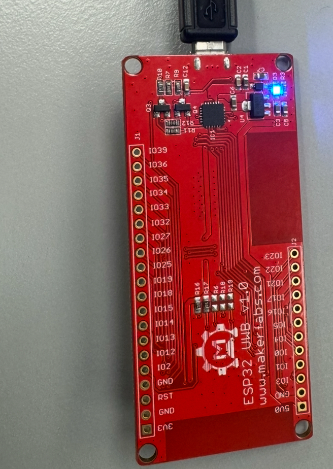

# ULTRA WIDE BAND (UWB)

## Project description
This project report explores the capabilities of Ultra-Wideband (UWB) technology for indoor positioning and secure data transfer between two devices. The main aim is to compare UWB technology with existing technologies with focus on Bluetooth and GPS, investigating how UWB can solve business challenges related to precise indoor location tracking and secure communication. 

For an efficient and proper investigation, we are using three **ESP32 UWB modules** for testing purposes. These modules serve as the core hardware for our experimental setup, which then allows us to evaluate UWB’s performance in real-world scenarios. The ESP32 UWB modules combine the processing power of the **ESP32 microcontroller** with **UWB transceivers**, enabling accurate distance measurement and data exchange between devices. Their compact design and integration flexibility make them ideal for prototyping and field testing in dynamic environments

For this project, we are focusing on a real-life application of this technology in use for Hockey Sport.

## Review UWB

### History of UWB

UWB’s roots trace back to Heinrich Hertz’s 1887 spark-gap experiments, which produced short, broadband electromagnetic pulses — effectively the first UWB transmissions. 

 

Interest in short-pulse radio returned in the mid-20th century, particularly for radar and military sensing applications, where large bandwidths offered high range resolution and resistance to jamming. Researchers explored impulse radar and time-domain electromagnetics, leading to early systems that could detect targets through walls and materials. These systems, though primitive, laid the foundation for modern UWB radar and localization technology. 

 

A pivotal moment came in the 1990s, when McEwan developed the Micropower Impulse Radar (MIR) at Lawrence Livermore National Laboratory. MIR used extremely short UWB pulses for motion and range detection while consuming minimal power. Around the same time, improvements in digital signal processing (DSP) and the invention of time-hopping impulse radio (TH-IR) and direct-sequence UWB (DS-UWB) revived UWB research for communications and localization. 

 

The turning point for UWB came in 2002, when the U.S. Federal Communications Commission (FCC) authorized unlicensed UWB operation in the 3.1–10.6 GHz band, under strict emission limits to ensure coexistence with other radio systems. This decision opened UWB to non-military use, notably high-speed short-range communications, localization, and radar sensing. 

### UWB Currently
Today, UWB represents a convergence of communication and sensing, a concept known as Integrated Sensing and Communication (ISAC). Researchers are exploring UWB for human activity recognition, smart environments, and Internet of Things (IoT) applications, while overcoming challenges like multipath interference, miniaturization, and power optimization. 

 

In 2022, imec unveiled an impulse-radio ultra-wideband (IR-UWB) transmitter chip achieving 1.66 Gb/s data rates at under 10 mW power consumption. Built in 28 nm CMOS and just 0.155 mm² in size, it delivers exceptional energy efficiency of about 5.8 pJ/bit, over ten times better than comparable Wi-Fi systems. This innovation combines impulse and phase modulation with a low-jitter oscillator and polar transmitter architecture, pushing UWB performance beyond current IEEE 802.15.4z standards. imec envisions applications in wearables, AR/VR, and biomedical implants, marking a major step toward high-speed, ultra-low-power wireless communication. 

## ESP32 UWB

The ESP32 UWB module integrates:

An ESP32 (WiFi + Bluetooth) microcontroller module (WROOM or WROVER)

A UWB transceiver (typically the Decawave/Qorvo DW1000 chip) for ultra-wideband ranging (time-of‐flight based)

A USB interface (Micro-USB) for power and programming.

In practical terms, this module allows you to perform WiFi/Bluetooth communications (via ESP32) and use UWB to measure distances (or positions) between devices with relatively high precision (on the order of tens of centimetres indoors).The module is designed as a “tag/anchor” device in a UWB ranging/localisation setup.

### Key Features

**Wireless / Processor**

ESP32 microcontroller (dual-core Xtensa LX6) with WiFi (2.4 GHz) + Bluetooth (BLE) — inherited from the ESP32 module.
UWB transceiver: DW1000 (for the “basic” version) – an IEEE 802.15.4-2011 UWB compliant chip: data rate up to 6.8 Mbps; indoor range up to ~300 m under ideal conditions.

**Ranging / Positioning**

Time-of-Flight (ToF) ranging between devices (“tags” and “anchors”). 
Indoor accuracy: about ±10 cm typical resolution (when properly calibrated) in research setups using ESP32+UWB boards.

**Power & connectivity**

USB Micro-USB connector, board supply voltage: ~4.8 V to 5.5 V (typical 5 V) for the board.
Standard ESP32 module running at 3.3 V internally; UWB chip supply/antenna must be appropriately decoupled/engineered.
GPIO and expansion headers for I/O, SPI communication to the UWB chip.

**Important variant comparisons**

| Variant              | UWB core           | Max range (approx)                                                  | Additional features                                |
| -------------------- | ------------------ | ------------------------------------------------------------------- | -------------------------------------------------- |
| UWB Basic            | DW1000             | ~45 m typical (cited)                         | Standard version                                   |
| UWB Pro (High Power) | DW1000 + amplifier | ~200 m (outdoor/line-of-sight)             | Longer range, same DW1000 core                     |
| UWB DW3000           | DW3000             | Additional channels (5 &9), Apple U1 interoperability | Next-gen UWB, lower power, broader channel support |

Bellow is an image of the module.

### ESP32 UWB (WROVER)

**Fron side**

**Back side**

## Comparison

This section compares Ultra-Wideband (UWB) technology with two other widely used positioning technologies: Global Positioning System (GPS) and Bluetooth Low Energy (BLE). The comparison focuses on accuracy, range, speed, energy efficiency, and suitability for indoor environments. Each technology has distinct strengths and weaknesses depending on the use case. 

### GPS
Global Positioning System (GPS) is a satellite-based navigation system that provides absolute location data using signals from multiple satellites orbiting the Earth. A GPS receiver determines its position by calculating the time-of-flight of radio signals from at least four satellites. 

GPS is highly effective for outdoor positioning because it offers global coverage and can achieve accuracy within 3–10 meters in open environments. It is commonly used in navigation, mapping, and fleet tracking applications. 

However, GPS performance drops significantly indoors or in areas with obstructions such as buildings or tunnels because satellite signals are weakened or blocked. It also consumes relatively high power, which makes it less suitable for battery-powered indoor tracking devices. Furthermore, GPS modules often have longer acquisition times (cold start) and require continuous connectivity to satellites, adding latency and energy costs. 

In summary, GPS provides reliable and precise outdoor tracking but struggles in indoor environments due to signal attenuation and energy consumption. 

### Bluetooth

Bluetooth Low Energy (BLE) technology is commonly used for short-range communication and indoor positioning. It operates in the 2.4 GHz frequency band and estimates proximity based on the signal strength (RSSI) between devices or beacons. 

BLE is well-suited for indoor environments because it does not rely on satellite visibility. It consumes very little power, making it ideal for smartphones, wearables, and IoT devices. BLE positioning systems can reach an accuracy of around 1–5 meters, depending on beacon density and environmental conditions. 

Nevertheless, BLE accuracy is affected by interference, device orientation, and obstacles such as walls or human bodies. It provides only relative position or proximity rather than precise coordinates. The range is also limited—typically between 10 and 50 meters depending on power level and antenna design. 

Overall, Bluetooth is cost-effective, energy-efficient, and functional indoors but offers lower accuracy and range compared to GPS. 

# Getting started with positioning

For the three modules we have, two of them have been set as the **tags** and one as the **anchor**.
(Anchor: Fixed in known location, listening for tags.Tag: Mobile device that sends/receives to/from anchors and calculates/gets distance or location.)

Power supply: Provide stable 5 V (via USB) to the board

Programming: We have used Arduino IDE.

### Getting Started

To get started, the following need to be done;

+ Install board : ESP32 .
+ Rename mf_DW1000.zip to DW1000.zip and install it.
+ Install library : Adafruit_SSD1306
+ Upload the code, select board "ESP32 DEV"

To get started with the identifying the devices, the MAC address of each device need to be known.

.
.
.

# Sources

https://wiki.makerfabs.com/ESP32_UWB.html?utm_source=chatgpt.com "ESP32 UWB/UWB Pro"
https://ca.robotshop.com/products/esp32-uwb-pro?utm_source=chatgpt.com "Makerfabs ESP32 UWB Pro"
https://www.tindie.com/products/makerfabs/esp32-uwb-dw3000ultra-wideband/?utm_source=chatgpt.com "ESP32 UWB DW3000(Ultra Wideband)"

